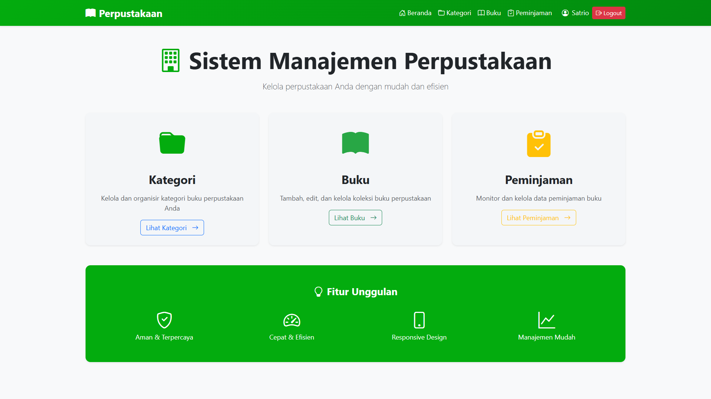
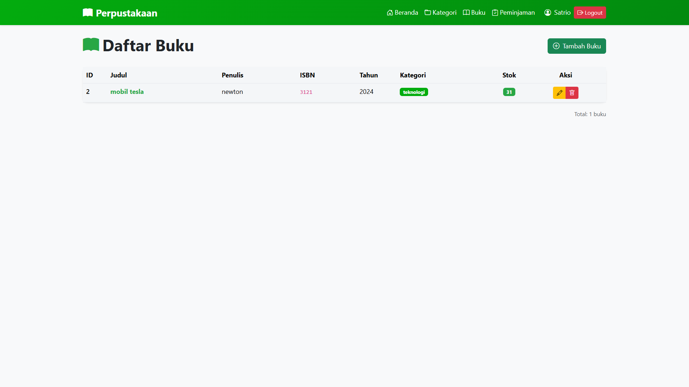
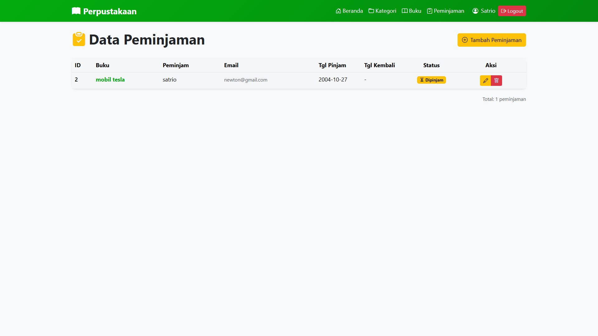

Tentu, saya akan memodifikasi file `README` Anda. Saya akan menghapus semua referensi tentang Tailwind CSS dan fokus langsung pada konfigurasi dan implementasi Bootstrap 5, menjadikannya dokumen yang lebih ringkas dan _straight-to-the-point_ untuk proyek Sistem Manajemen Perpustakaan versi Bootstrap 5 Anda.

Berikut adalah versi `README` yang sudah diperbarui:

```markdown
# 📚 Sistem Manajemen Perpustakaan (Bootstrap 5 Version)

Aplikasi web untuk mengelola perpustakaan dengan fitur CRUD categories, books, dan borrowings menggunakan **Bootstrap 5**.

## 🚀 Teknologi

### Backend

- Laravel 12
- MySQL
- Laravel Sanctum (Authentication)
- REST API

### Frontend

- React JS 18
- React Router DOM
- Axios
- **Bootstrap 5.3.2 ✨**
- **Bootstrap Icons**

## 📁 Struktur Project
```

sistem-manajemen-perpustakaan/
├── perpustakaan-backend/ \# Laravel REST API
└── perpustakaan-frontend/ \# React Application (Bootstrap 5)

````

## ✨ Fitur

- ✅ Authentication (Login & Register)
- ✅ CRUD Categories
- ✅ CRUD Books
- ✅ CRUD Borrowings
- ✅ Relasi antar tabel
- ✅ Automatic stock management
- ✅ Token-based authentication
- ✅ **Responsive design** menggunakan Bootstrap Grid System.
- ✅ **Modern UI** dengan Bootstrap Icons dan Custom Theming.
- ✅ **Smooth animations & transitions** (Menggunakan Custom CSS).

## 🛠️ Cara Menjalankan Project

### Backend (Laravel)

1. Masuk ke folder backend:
```bash
cd perpustakaan-backend
````

2.  Install dependencies:

<!-- end list -->

```bash
composer install
```

3.  Copy file .env:

<!-- end list -->

```bash
cp .env.example .env
```

4.  Generate key:

<!-- end list -->

```bash
php artisan key:generate
```

5.  Setup database di `.env`:

<!-- end list -->

```env
DB_DATABASE=db_perpustakaan
DB_USERNAME=root
DB_PASSWORD=
```

6.  Migrate database:

<!-- end list -->

```bash
php artisan migrate
```

7.  Install Sanctum:

<!-- end list -->

```bash
php artisan install:api
```

8.  Jalankan server:

<!-- end list -->

```bash
php artisan serve
```

Server berjalan di: `http://127.0.0.1:8000`

### Frontend (React + Bootstrap 5)

1.  Masuk ke folder frontend:

<!-- end list -->

```bash
cd perpustakaan-frontend
```

2.  Install dependencies:

<!-- end list -->

```bash
npm install
# Packages utama yang diinstal: bootstrap@^5.3.2 dan bootstrap-icons@^1.11.3
```

> **Catatan:** Pastikan `bootstrap` dan `bootstrap-icons` telah diinstal di `package.json`.

3.  Jalankan development server:

<!-- end list -->

```bash
npm run dev
```

Server berjalan di: `http://localhost:5173`

---

## 🎨 Detail Implementasi Bootstrap 5

Proyek ini sepenuhnya memanfaatkan fitur Bootstrap 5, termasuk:

- **Layout:** Container dan Grid System (`row`, `col`) untuk desain responsif.
- **Komponen:** Navbar, Cards, Forms, Tables, Alerts, dan Buttons.
- **Kustomisasi:** Skema warna kustom diterapkan melalui penimpaan (override) **CSS Custom Properties** di file `index.css`.

---

## 📸 Tampilan :

## Tampilan Utama



## Tampian Kategori Buku


## Tampilan Daftar Buku



## Tampilan Data Peminjaman Buku



## 👨‍💻 Developer

- **Nama:** Satrio Aji Atmojo
- **NIM:** G.211.23.0054
- **Prodi:** Teknik Informatika
- **Mata Kuliah:** Rekayasa Web

## 📄 License

This project is for educational purposes.

```

```
